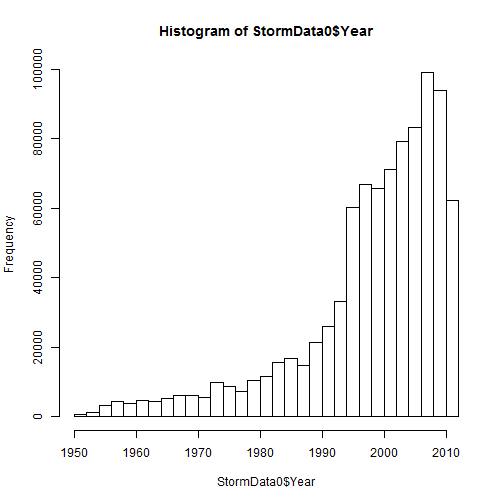
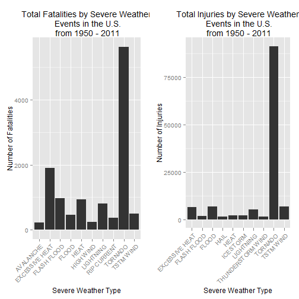
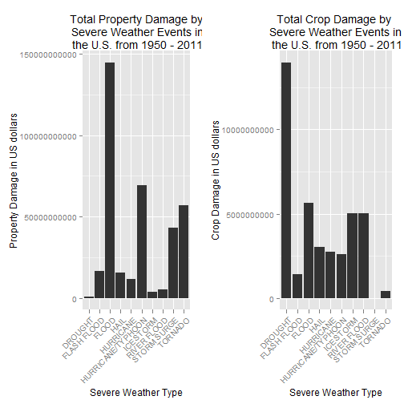

##Synopsis

The purposes of this report is to analyse and explore the U.S. National Oceanic and Atmospheric Administration's storm database from 1950 - 2011. This data will be used to understand which types of events has most significant effects to public health and economic consequences across the United States.

The results of the below analysis shows that tornado is the cause of the most harm with respect to population health, flood causes the most property damage and drought the most crop damage,


##Data Processing

In this section, we will be downloading the data set and perform basic processing for analysis.


```r
if (!"stormData.csv.bz2" %in% dir(getwd())){
    print("downloading file")
    download.file("http://d396qusza40orc.cloudfront.net/repdata%2Fdata%2FStormData.csv.bz2", destfile = paste(getwd(), "/stormData.csv.bz2", sep =  ""))
}

if (!"StormData0" %in% ls()) {
    StormData0 <-  read.csv(bzfile("stormData.csv.bz2"), header = TRUE, stringsAsFactors = FALSE)
}
dim(StormData0)
```

```
## [1] 902297     38
```

```r
head(StormData0)
```

```
##   STATE__           BGN_DATE BGN_TIME TIME_ZONE COUNTY COUNTYNAME STATE
## 1       1  4/18/1950 0:00:00     0130       CST     97     MOBILE    AL
## 2       1  4/18/1950 0:00:00     0145       CST      3    BALDWIN    AL
## 3       1  2/20/1951 0:00:00     1600       CST     57    FAYETTE    AL
## 4       1   6/8/1951 0:00:00     0900       CST     89    MADISON    AL
## 5       1 11/15/1951 0:00:00     1500       CST     43    CULLMAN    AL
## 6       1 11/15/1951 0:00:00     2000       CST     77 LAUDERDALE    AL
##    EVTYPE BGN_RANGE BGN_AZI BGN_LOCATI END_DATE END_TIME COUNTY_END
## 1 TORNADO         0                                               0
## 2 TORNADO         0                                               0
## 3 TORNADO         0                                               0
## 4 TORNADO         0                                               0
## 5 TORNADO         0                                               0
## 6 TORNADO         0                                               0
##   COUNTYENDN END_RANGE END_AZI END_LOCATI LENGTH WIDTH F MAG FATALITIES
## 1         NA         0                      14.0   100 3   0          0
## 2         NA         0                       2.0   150 2   0          0
## 3         NA         0                       0.1   123 2   0          0
## 4         NA         0                       0.0   100 2   0          0
## 5         NA         0                       0.0   150 2   0          0
## 6         NA         0                       1.5   177 2   0          0
##   INJURIES PROPDMG PROPDMGEXP CROPDMG CROPDMGEXP WFO STATEOFFIC ZONENAMES
## 1       15    25.0          K       0                                    
## 2        0     2.5          K       0                                    
## 3        2    25.0          K       0                                    
## 4        2     2.5          K       0                                    
## 5        2     2.5          K       0                                    
## 6        6     2.5          K       0                                    
##   LATITUDE LONGITUDE LATITUDE_E LONGITUDE_ REMARKS REFNUM Year
## 1     3040      8812       3051       8806              1 1950
## 2     3042      8755          0          0              2 1950
## 3     3340      8742          0          0              3 1951
## 4     3458      8626          0          0              4 1951
## 5     3412      8642          0          0              5 1951
## 6     3450      8748          0          0              6 1951
```

```r
StormData0$Year <- as.numeric(format(as.Date(StormData0$BGN_DATE, format = "%m/%d/%Y %H:%M:%S"), "%Y"))
```
The data ranges from 1950 to 2011. Below is a histogram of the number of incidents reports by year as well as a summary of the data, it shows that most of the incidents recorded occurs after 2000, most likely due to the lack of good records available.


```r
hist(StormData0$Year, breaks = 30)
```

 

```r
summary(StormData0$Year)
```

```
##    Min. 1st Qu.  Median    Mean 3rd Qu.    Max. 
##    1950    2000    2000    2000    2010    2010
```

We now reduce the data set to the only variables needed: EVTYPE, FATALITIES, INJURIES, PROPDMG, PROPDMGEXP, CROPDMG, CROPDMGEXP and convert the property and crop damage data into numerical forms according to the meaning of units described in the code book ([Storm  Events](http://ire.org/nicar/database-library/databases/storm-events/)). Both `PROPDMGEXP` and `CROPDMGEXP` columns record a multiplier for each observation where we have Hundred (H), Thousand (K), Million (M) and Billion (B).


```r
StormData <- StormData0 %>%
    select(EVTYPE, FATALITIES, INJURIES, PROPDMG, PROPDMGEXP, CROPDMG, CROPDMGEXP)
```

```r
StormData$PROPDMGEXP[StormData$PROPDMGEXP == 'B'] <- 9
StormData$PROPDMGEXP[StormData$PROPDMGEXP == 'M'] <- 6
StormData$PROPDMGEXP[StormData$PROPDMGEXP == 'K'] <- 3
StormData$PROPDMGEXP[StormData$PROPDMGEXP == 'H'] <- 2
StormData$PROPDMGEXP[StormData$PROPDMGEXP == ''] <- 0
StormData$PROPDMGEXP <- as.numeric(StormData$PROPDMGEXP)
StormData$PROPDMGEXP[is.na(StormData$PROPDMGEXP)] <- 0

StormData$CROPDMGEXP[StormData$CROPDMGEXP == 'B'] <- 9
StormData$CROPDMGEXP[StormData$CROPDMGEXP == 'M'] <- 6
StormData$CROPDMGEXP[StormData$CROPDMGEXP == 'K'] <- 3
StormData$CROPDMGEXP[StormData$CROPDMGEXP == 'H'] <- 2
StormData$CROPDMGEXP[StormData$CROPDMGEXP == ''] <- 0
StormData$CROPDMGEXP <- as.numeric(StormData$CROPDMGEXP)
StormData$CROPDMGEXP[is.na(StormData$CROPDMGEXP)] <- 0

StormData$PropertyDamage <- StormData$PROPDMG * 10^StormData$PROPDMGEXP
StormData$CropDamage <- StormData$CROPDMG * 10^StormData$CROPDMGEXP
```

```r
trim <- function (x) gsub("^[:space:]+|[:space]+$", "", x)
StormData$EVTYPE <- toupper(StormData$EVTYPE)
StormData$EVTYPE <- trim(StormData$EVTYPE)
```
##Results
### Which types of events are most harmful with respect to population and health?

```r
Population <- StormData %>%
    group_by(EVTYPE) %>%
    summarise(TotalFatalities = sum(FATALITIES),
              TotalInjuries = sum(INJURIES))

Fatalities <- Population %>%
    select(EVTYPE, TotalFatalities) %>%
    top_n(10) %>%
    arrange(-TotalFatalities)

Injuries <- Population %>%
    select(EVTYPE, TotalInjuries) %>%
    top_n(10) %>%
    arrange(-TotalInjuries)
```
Based on the analysis, below are the two sorted lists indicating the top 10 fatalities and injuries based on event type.

####Fatalities


|EVTYPE         | TotalFatalities|
|:--------------|---------------:|
|TORNADO        |            5633|
|EXCESSIVE HEAT |            1903|
|FLASH FLOOD    |             978|
|HEAT           |             937|
|LIGHTNING      |             816|
|TSTM WIND      |             504|
|FLOOD          |             470|
|RIP CURRENT    |             368|
|HIGH WIND      |             248|
|AVALANCHE      |             224|


####Injuries


|EVTYPE            | TotalInjuries|
|:-----------------|-------------:|
|TORNADO           |         91346|
|TSTM WIND         |          6957|
|FLOOD             |          6789|
|EXCESSIVE HEAT    |          6525|
|LIGHTNING         |          5230|
|HEAT              |          2100|
|ICE STORM         |          1975|
|FLASH FLOOD       |          1777|
|THUNDERSTORM WIND |          1488|
|HAIL              |          1361|


And the following is a pair of graphs of total fatalities and total injuries affected by these severe weather events. 

```r
fatalitiesPlot <- qplot(EVTYPE, data = Fatalities, weight = TotalFatalities, geom = "bar", binwidth = 1) + 
    scale_y_continuous("Number of Fatalities") + 
    theme(axis.text.x = element_text(angle = 45, 
    hjust = 1)) + xlab("Severe Weather Type") + 
    ggtitle("Total Fatalities by Severe Weather\n Events in the U.S.\n from 1950 - 2011")
injuriesPlot <- qplot(EVTYPE, data = Injuries, weight = TotalInjuries, geom = "bar", binwidth = 1) + 
    scale_y_continuous("Number of Injuries") + 
    theme(axis.text.x = element_text(angle = 45, 
    hjust = 1)) + xlab("Severe Weather Type") + 
    ggtitle("Total Injuries by Severe Weather\n Events in the U.S.\n from 1950 - 2011")
grid.arrange(fatalitiesPlot, injuriesPlot, ncol = 2)
```

 

From the above results, we can conclude that Tornado causes the most injuries and fatalities.

###Which type of events have the greatest economic consequences?

```r
Economic <- StormData %>%
    select(EVTYPE, PropertyDamage, CropDamage) %>%
    group_by(EVTYPE) %>%
    summarise(TotalDamage = sum(PropertyDamage) + sum(CropDamage),
              TotalProperty =  sum(PropertyDamage),
              TotalCrop = sum(CropDamage)) %>%
    top_n(10, TotalDamage) %>%
    arrange(-TotalDamage)
```

Combining the total damages to property and crop, below table indicates the to 10 event types that causes greatest economic consequences and their associated property and flood damages.


|EVTYPE            |  TotalDamage| TotalProperty|   TotalCrop|
|:-----------------|------------:|-------------:|-----------:|
|FLOOD             | 150319678257|  144657709807|  5661968450|
|HURRICANE/TYPHOON |  71913712800|   69305840000|  2607872800|
|TORNADO           |  57350833958|   56935880688|   414953270|
|STORM SURGE       |  43323541000|   43323536000|        5000|
|HAIL              |  18755905408|   15730367518|  3025537890|
|FLASH FLOOD       |  18243991079|   16822673979|  1421317100|
|DROUGHT           |  15018672000|    1046106000| 13972566000|
|HURRICANE         |  14610229010|   11868319010|  2741910000|
|RIVER FLOOD       |  10148404500|    5118945500|  5029459000|
|ICE STORM         |   8967041360|    3944927860|  5022113500|


And the following is a pair of graphs of total fatalities and total injuries affected by these severe weather events. 


```r
propertyPlot <- qplot(EVTYPE, data = Economic, weight = TotalProperty, geom = "bar", binwidth = 1) + 
    theme(axis.text.x = element_text(angle = 45, hjust = 1)) + scale_y_continuous("Property Damage in US dollars")+ 
    xlab("Severe Weather Type") + ggtitle("Total Property Damage by\n Severe Weather Events in\n the U.S. from 1950 - 2011")

cropPlot<- qplot(EVTYPE, data = Economic, weight = TotalCrop, geom = "bar", binwidth = 1) + 
    theme(axis.text.x = element_text(angle = 45, hjust = 1)) + scale_y_continuous("Crop Damage in US dollars") + 
    xlab("Severe Weather Type") + ggtitle("Total Crop Damage by \nSevere Weather Events in\n the U.S. from 1950 - 2011")
grid.arrange(propertyPlot, cropPlot, ncol = 2)
```

 

We can conclude that flood causes the most property damages in the US with drought as the cause of the most crop damage. However, flood is the cause of the greatest total economic consequence followed by hurricane/typhoon.

